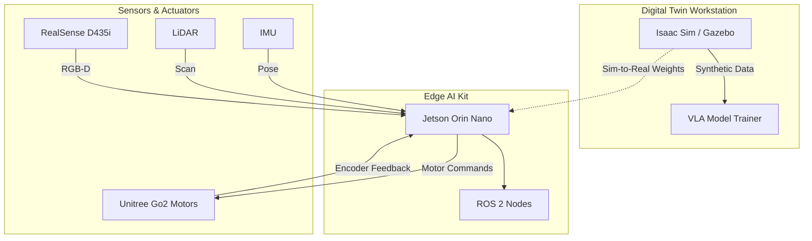

# Lab Architecture

## Summary of Architecture
To teach this successfully, your lab infrastructure should look like this:

| Component | Hardware | Function |
| :--- | :--- | :--- |
| **Sim Rig** | PC with RTX 4080 + Ubuntu 22.04 | Runs Isaac Sim, Gazebo, Unity, and trains LLM/VLA models. |
| **Edge Brain** | Jetson Orin Nano | Runs the "Inference" stack. Students deploy their code here. |
| **Sensors** | RealSense Camera + LiDAR | Connected to the Jetson to feed real-world data to the AI. |
| **Actuator** | Unitree Go2 or G1 (Shared) | Receives motor commands from the Jetson. |

## Architecture Diagram

## Lab Deployment Options

Building a "Physical AI" lab is a significant investment. You must choose between an On-Premise Lab (High CapEx) or a Cloud-Native Lab (High OpEx).

### Option 1: On-Premise Lab (High CapEx)
*   **Pros:** Low latency, direct hardware access, no recurring cloud costs.
*   **Cons:** High initial cost per station.

### Option 2: The "Ether" Lab (Cloud-Native / High OpEx)
Best for rapid deployment or students with weak laptops.
1.  **Cloud Workstations:** AWS g5.2xlarge or Azure instances running NVIDIA Isaac Sim on Omniverse Cloud.
    *   *Cost:* ~$205 per student/quarter.
2.  **Local "Bridge" Hardware:**
    *   **Edge AI Kits:** Students still need a Jetson Kit ($700) for physical deployment.
    *   **Robot:** One physical robot shared for final demos.

## The Latency Trap
**Warning:** Simulating in the cloud works well, but controlling a real robot directly from a cloud instance is dangerous due to latency (network lag).
*   **Solution:** Students **train** in the Cloud, download the model weights, and **flash** them to the local Jetson kit for execution.

## The Economy Jetson Student Kit
For students building their own kit:
*   **The Brain:** NVIDIA Jetson Orin Nano Super Dev Kit (~$249).
*   **The Eyes:** Intel RealSense D435i (~$349).
*   **The Ears:** ReSpeaker USB Mic Array (~$69).
*   **Total:** ~$700 per kit.